# PathForge — Learn → Build → Prove

[](https://github.com/saabz131395-code/pathforge/actions/workflows/tests.yml)

**🌐 Live demo: [saba1313.pythonanywhere.com](https://saba1313.pythonanywhere.com)**

PathForge helps learners stop collecting courses and start building proof. A learner picks a career direction (or takes a short quiz), takes a 6-question level check, and gets a personalised start guide: where to start, how to study at their level, what to build, and how to prove it. CV wording unlocks only after the work is actually done.

**Built with:** Python · Flask · Jinja2 · SQLite · vanilla JavaScript · PyYAML · pytest · GitHub Actions

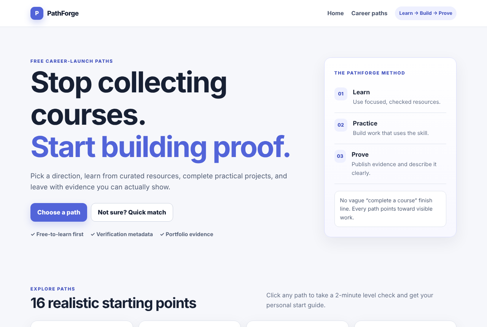

## Why it exists

Many "free skills" and freelancing-training sites are low quality or outright scams, and people who do find good free resources often don't know how to turn them into work they can show. PathForge focuses on three things:

- **Trust you can inspect.** Every resource shows which checks it has passed. Nothing is labelled *Verified* unless a human confirmed its cost, level and skill fit **and** an automated link check passed recently.
- **Projects over certificates.** Each path ends in portfolio projects with clear proof requirements.
- **No fake experience.** CV wording stays locked until a project is marked as both built and published.

## Features

| Screen | What it does |
| --- | --- |
| Choose a path | 16 career paths (one click starts the level check), or a 4-question quick-match quiz |
| Home guides | Learning tips, free tools for publishing proof, and honest first freelance steps |
| Level check | 6 real knowledge questions per path (2 basic, 2 intermediate, 2 advanced), one at a time, scored to Beginner / Intermediate / Advanced |
| My plan | Score, the topics you missed (with answers and explanations), and a 5-step start guide: where, when, how, what to build, how to prove it |
| Path overview | Focus, practice summary and the Learn → Practice → Build → Prove sequence |
| Learn | Filter resources by level, type, verified status and free certificate |
| Practice | Beginner, intermediate and advanced projects with effort ranges and proof requirements |
| Progress | Checklist saved in the browser only — no account, nothing uploaded |
| Prove it | Suggested CV wording that unlocks only after built + published |

**Career paths:** Web Development · UI/UX Design · Python/Data · Data Analysis · Digital Marketing · Content/Video · Software Testing · Cloud/IT Basics · Technical Writing · Cybersecurity Basics · Mobile App Development · AI/Machine Learning · Graphic Design · Content Writing/Copywriting · E-commerce Store Management · Game Development

<details>
<summary>More screenshots</summary>

| Level check | Personalised result |
| --- | --- |
| 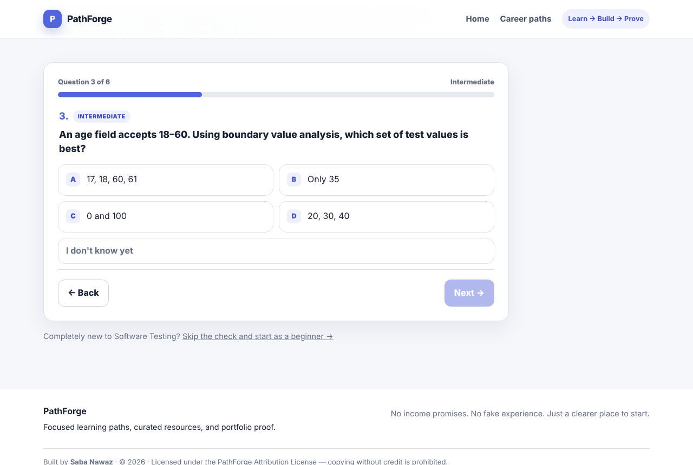 | 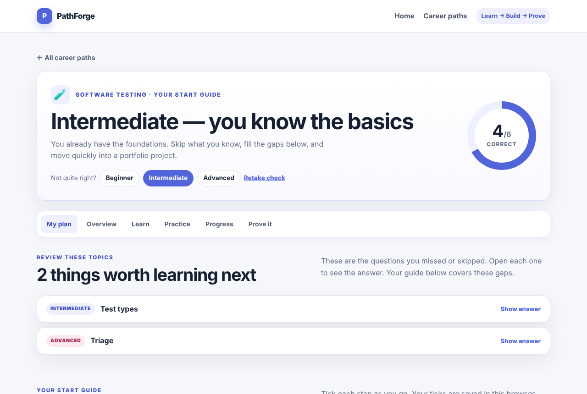 |
| **Start guide** | **Quick-match quiz** |
| 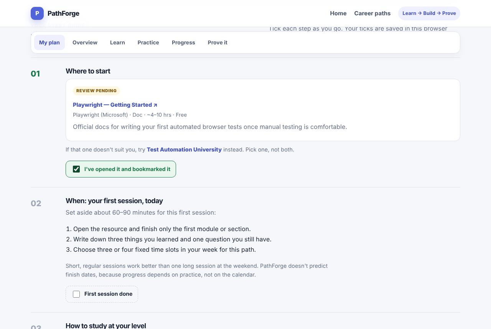 | 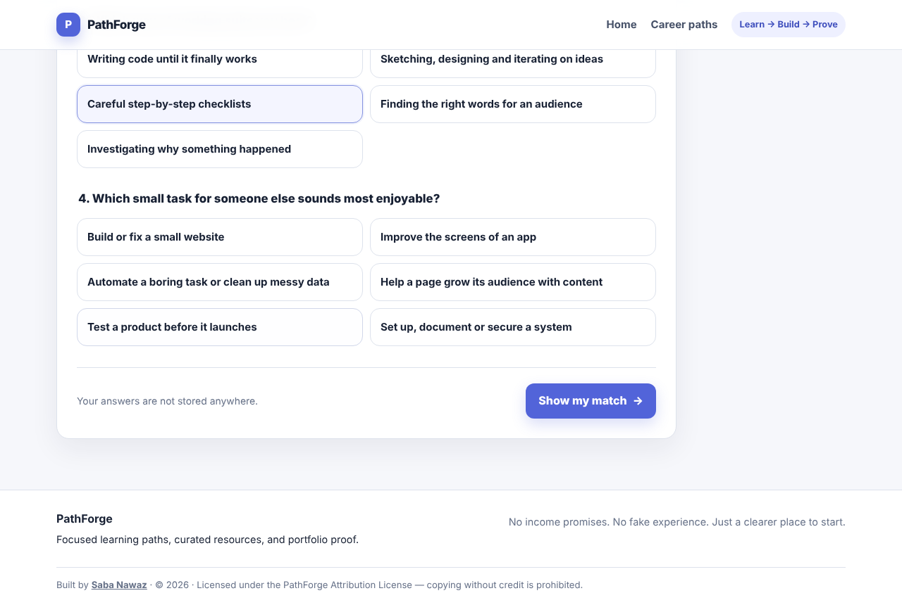 |
| **Path overview** | **Learning tips & tools** |
| 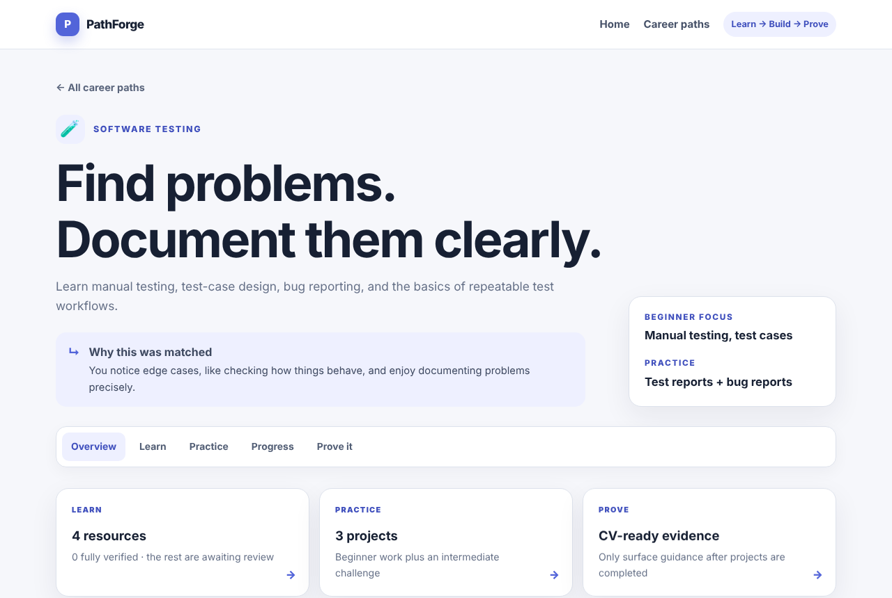 | 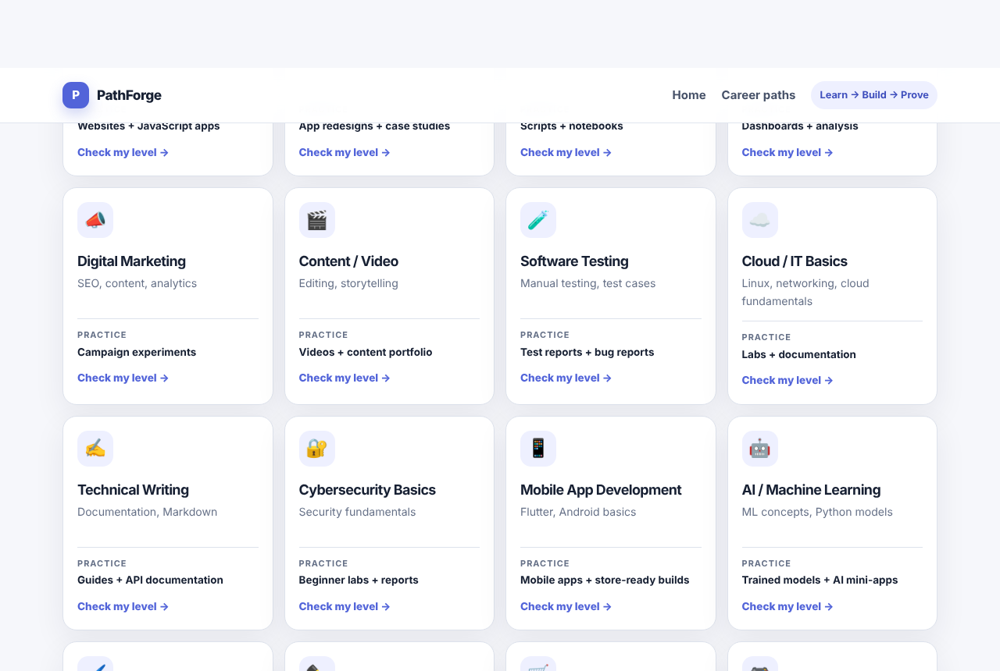 |
| **Resources with trust record** | **Progress checklist** |
| 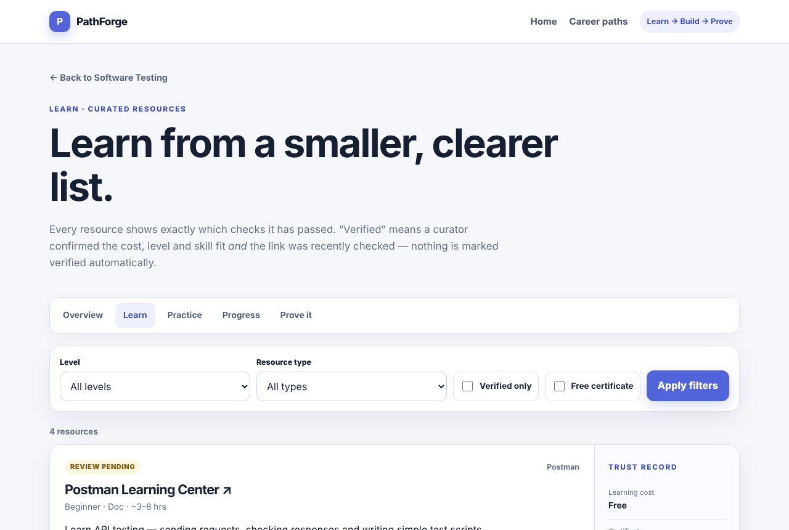 | 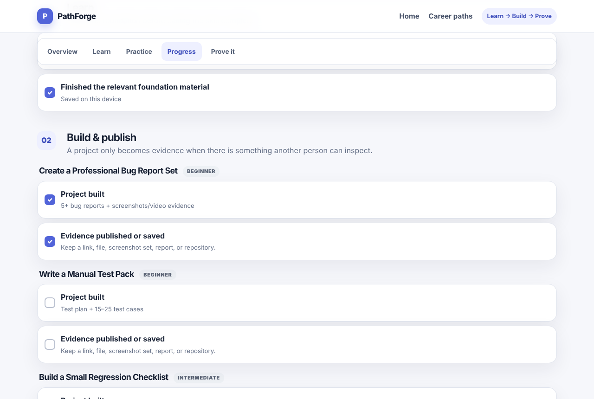 |
| **Proof / CV guidance** | **Mobile** |
| 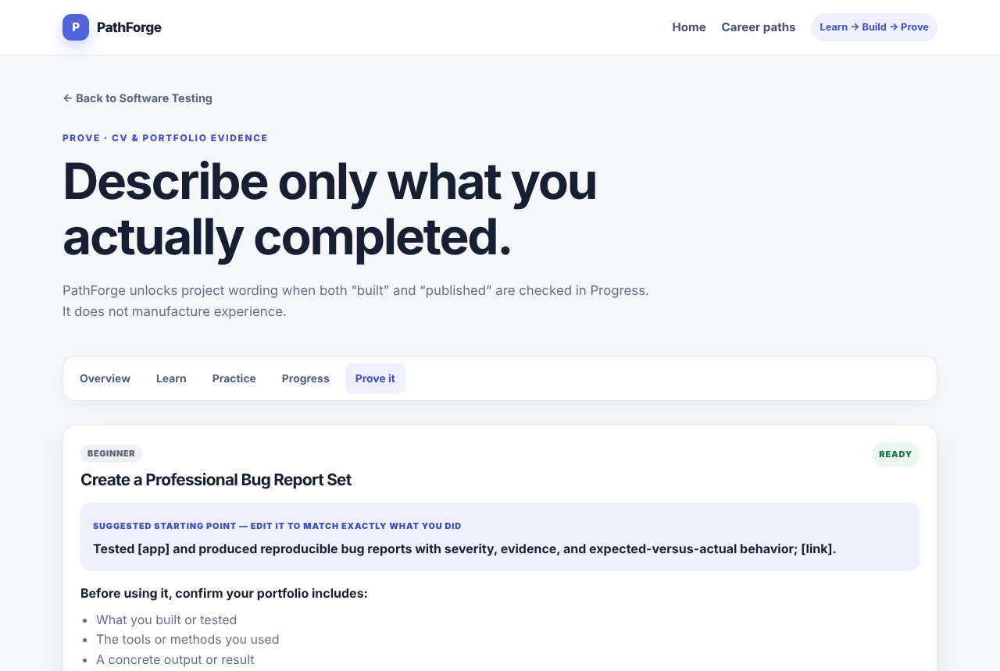 | 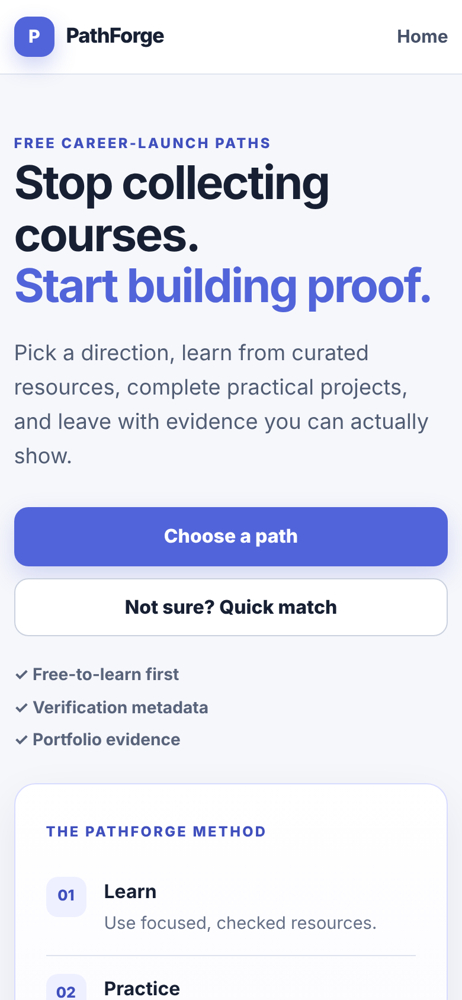 |

</details>

## Run it locally (Windows)

```powershell
python -m venv .venv
.\.venv\Scripts\activate
pip install -r requirements.txt
python seed.py
python run.py
```

Open <http://127.0.0.1:5000>. On macOS/Linux, activate with `source .venv/bin/activate`.

The database is created automatically on first run if you skip `python seed.py`. To turn on Flask's debug mode while developing, set `FLASK_DEBUG=1` first.

## Run the tests

```bash
python -m pytest
```

The suite (58 tests) covers the recommendation and level-check scoring rules, the question bank, every page and redirect, input validation, the verification rules, re-seeding behaviour and the link checker (with a fake network, so tests never touch the internet). GitHub Actions runs it on every push.

## How the content works

All content lives in plain YAML so it can be edited without touching code:

```
catalog/
  paths.yaml       career paths, in display order
  resources.yaml   curated learning resources (the allowlist)
  projects.yaml    portfolio projects
  assessments.yaml level-check questions (6 per path)
  home.yaml        home page tips, tools and freelance steps
```

`python seed.py` validates these files (clear error messages for typos, unknown paths, bad URLs, duplicate ids, and paths without exactly 2 questions per tier) and rebuilds the database from them. Answer options are shuffled automatically, the same way every time.

### How a resource becomes "Verified"

1. A curator adds it to `catalog/resources.yaml`. All four `curator_checks` start as `PENDING`.
2. After personally confirming the learning cost, certificate cost, level and skill fit, the curator sets those checks to `PASS`.
3. `python -m scraper.recheck` checks that the link works and records the date.
4. The resource shows **Verified** only when all five checks pass. Broken links are hidden from learners automatically.

Link-check history is stored separately and keyed by each resource's permanent `id`, so re-running `python seed.py` never erases it. See [scraper/README.md](scraper/README.md) for options.

## Project structure

```
app/
  __init__.py        app factory, error pages
  db.py              one connection per request, always closed
  routes/            URL handling only — no SQL
  services/          catalog.py (all SQL) · recommendation.py · assessment.py (scoring + start guide)
  templates/         shared Jinja templates used by every path
  static/            CSS and small JS (progress + proof screens)
catalog/             YAML content
database/            schema.sql · init_db.py (YAML → SQLite)
scraper/recheck.py   link checker
tests/               unittest-style tests, run with pytest
```

Design rules: no sessions (state travels in the URL), every POST redirects (Post/Redirect/Get), routes never contain SQL, and the meaning of "verified" is defined in exactly one place (the `resource_catalog` view in `schema.sql`).

## Deliberately out of scope for V1

Accounts, payments, AI-generated recommendations or CV text, community reviews and server-side progress. The goal is a small, honest product that can grow without rewriting the UI for each path.

## Credits

PathForge was created and is maintained by **[Saba Nawaz](https://github.com/saabz131395-code)**.

If you use, fork, or build on this project, you are required to keep this credit visible. Do not present this project as your own work.

## License

Licensed under the **PathForge Attribution License** — free to use and modify, **but attribution to Saba Nawaz is mandatory**. See [LICENSE](LICENSE) and [NOTICE.md](NOTICE.md).

**You may NOT remove the credit "Built by Saba Nawaz" from the app, the README, or the license files.**
